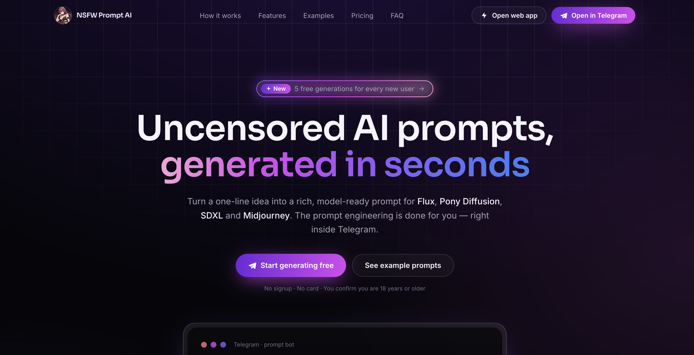

<p align="center">
  
</p>

<p align="center">
  <a href="https://t.me/nsfw_prompt_generator_bot" target="_blank" rel="noopener noreferrer">
    
  </a>
  <a href="https://nsfwprompts.app/" target="_blank" rel="noopener noreferrer">
    
  </a>
  <a href="https://t.me/nsfwprompts_ai" target="_blank" rel="noopener noreferrer">
    
  </a>
  <a href="https://nsfwprompts.app/generator" target="_blank" rel="noopener noreferrer">
    
  </a>
</p>

<p align="center">
  
  
  
  
  
  
</p>

---

**Built by <a href="https://t.me/vxdosick" target="_blank" rel="noopener noreferrer">vxdosick</a>** — I build web products, Telegram bots, and AI integrations.

Turn a one-line idea into a rich, model-ready prompt for Pony XL, Fluxed Up, Pony Diffusion, Illustrious, Automatic1111, ComfyUI, Fooocus, Forge, RealVisXL, Juggernaut XL, CyberRealistic, NoobAI-XL, Grok-2, Persephone, and other NSFW models — right inside Telegram. No prompt-engineering rabbit holes, no complex dashboards. Describe your scene, copy the result, generate.

**Try it now:** <a href="https://t.me/nsfw_prompt_generator_bot" target="_blank" rel="noopener noreferrer">@nsfw_prompt_generator_bot</a> · **Channel:** <a href="https://t.me/nsfwprompts_ai" target="_blank" rel="noopener noreferrer">@nsfwprompts_ai</a> · **Site:** <a href="https://nsfwprompts.app/" target="_blank" rel="noopener noreferrer">nsfwprompts.app</a> · **Web app** — coming soon (same product, outside Telegram)

---

## Preview

<p align="center">
  
</p>

<p align="center"><em>One message in → polished, uncensored, model-specific prompt out.</em></p>

---

## At a glance

| | |
|---|---|
| **What** | AI Telegram bot that writes detailed, uncensored image prompts |
| **For** | Creators using Pony XL, Fluxed Up, Pony Diffusion, Illustrious, Automatic1111, ComfyUI, Fooocus, Forge, RealVisXL, Juggernaut XL, CyberRealistic, NoobAI-XL, Grok-2, Persephone, and other NSFW models |
| **Why** | Skip tag wrangling — get pro-level prompts in ~3 seconds |
| **Start** | 5 free generations, no card · top up via Stripe or Stars in `/balance` |

---

## Metrics

<p align="center">
  
</p>

<p align="center">
  <strong>320+</strong> users on the bot · <strong>500+</strong> prompts generated · <strong>70+</strong> saved to favorites · <strong>50%</strong> return for another session · <strong>5</strong> free gens for every newcomer · <strong>14+</strong> image models supported
</p>

---

## Features

- **AI prompt generation** — one plain-language line → structured, high-detail, uncensored prompt (lighting, lens, mood, composition included)
- **Model-tuned output** — syntax optimized for Pony XL, Fluxed Up, Pony Diffusion, Illustrious, Automatic1111, ComfyUI, Fooocus, Forge, RealVisXL, Juggernaut XL, CyberRealistic, NoobAI-XL, Grok-2, Persephone, and other NSFW models
- **Copy-ready in one tap** — paste straight into your image pipeline
- **Friend & group chats** — use the bot in a 1:1 with a friend (Guest Chat) or in a group, not only in DM with the bot. Example: open your chat with a friend → invoke <a href="https://t.me/nsfw_prompt_generator_bot" target="_blank" rel="noopener noreferrer">@nsfw_prompt_generator_bot</a> and send `cyberpunk succubus, neon rain, 8k`; in a group: `@nsfw_prompt_generator_bot confident woman in red dress, rooftop at night`
- **Save favorites** — store and browse up to 5 prompts (`/prompts`; limit may grow)
- **Credits & balance** — free trial, then Stripe checkout or Telegram Stars inside the bot
- **Private by design** — no names, no emails; only what’s needed to run credits and generations
- **Maintenance mode** — flip one env flag to pause the bot for everyone except the owner
- **Dev/prod split** — local dev bot + ngrok without touching the live Render deployment
- **Changelog in-bot** — `/whats_new` for the latest shipped features
- **Telegram channel** — news, new features, Q&A & behind-the-scenes at <a href="https://t.me/nsfwprompts_ai" target="_blank" rel="noopener noreferrer">@nsfwprompts_ai</a>
- **Block-aware DB** — `is_blocked` tracking when users block the bot (cleaner outreach)

---

## Color palette

Brand colors used across the <a href="https://nsfwprompts.app/" target="_blank" rel="noopener noreferrer">landing site</a>, bot UI copy, and marketing.

<p align="center">
  
</p>

| # | Token | HEX | Role |
|---|-------|-----|------|
| 1 | **ink** | `#06060a` | Page background, modals, dark base |
| 2 | **text** | `#f6f4ff` | Primary text, buttons, light on dark |
| 3 | **violet-deep** | `#6d28d9` | Brand accent — CTA, gradients, focus |
| 4 | **magenta** | `#d946ef` | Second accent — glow, shimmer, gradients |
| 5 | **muted** | `#a6a3b8` | Secondary text, captions, calm UI |

<p align="center">
  
  
  
  
  
</p>

---

## Quick start

```bash
git clone https://github.com/vxdosick/ai-prompt-generator-telegram-bot.git
cd ai-prompt-generator-telegram-bot
python -m venv venv && source venv/bin/activate   # Windows: venv\Scripts\activate
pip install -r requirements.txt
cp .env.example .env   # fill in tokens, DB URL, Stripe, OpenRouter
alembic upgrade head
uvicorn server.main:server --reload
```

Then expose locally (e.g. ngrok), set `SERVER_URL`, and register the webhook:

```bash
ngrok http 8000
python -m core.set_webhook
```

Open <a href="https://t.me/nsfw_prompt_generator_bot" target="_blank" rel="noopener noreferrer">@nsfw_prompt_generator_bot</a> only after you intend to use **your** bot token — for local work, use the **dev bot** flow below.

---

## Tech stack

<p align="center">
  
  
  
  
  
  
  
  
  
  
  
  
</p>

| Layer | Technology |
|-------|------------|
| Runtime |  Python 3.12 |
| Bot |  <a href="https://github.com/python-telegram-bot/python-telegram-bot" target="_blank" rel="noopener noreferrer">python-telegram-bot</a> |
| API |  <a href="https://fastapi.tiangolo.com/" target="_blank" rel="noopener noreferrer">FastAPI</a> +  <a href="https://www.uvicorn.org/" target="_blank" rel="noopener noreferrer">Uvicorn</a> |
| Database |  PostgreSQL ( <a href="https://neon.tech/" target="_blank" rel="noopener noreferrer">Neon</a>) |
| ORM |  SQLAlchemy 2.0 (async) |
| Migrations |  Alembic |
| AI |  <a href="https://openrouter.ai/" target="_blank" rel="noopener noreferrer">OpenRouter</a> API |
| Payments |  Stripe +  Telegram Stars |
| Deploy |  <a href="https://render.com/" target="_blank" rel="noopener noreferrer">Render</a> |
| Local dev |  ngrok (webhook tunneling) |

---

## Bot commands

| Command | Description |
|---------|-------------|
| `/start` | Getting started |
| `/help` | Usage help |
| `/balance` | Credits & buy generations |
| `/prompts` | View saved prompts |
| `/models` | Model-specific prompt commands |
| `/whats_new` | Latest updates & changelog |
| `/terms` | Privacy & refund policy |
| `/contacts` | Contact developer / report a bug |

---

## Installation & setup

### 1. Environment

Copy `.env.example` → `.env` and configure:

| Variable | Purpose |
|----------|---------|
| `BOT_TOKEN`, `BOT_LINK` | Production Telegram bot |
| `SERVER_URL` | Public URL (Render or ngrok) for webhooks & checkout |
| `POSTGRES_URL` | Neon async Postgres URL |
| `OPENAI_API_KEY`, `AI_MODEL` | OpenRouter key & model id |
| `STRIPE_LIVE_*` | Stripe secret + webhook secret |
| `PAYMENT_*` | Pack label, prices, credits |
| `OWNER_TELEGRAM_ID` | Optional owner perks |
| `MAINTENANCE_MODE` | `true` = maintenance for all except owner |
| `MAX_SAVED_PROMPTS` | Saved prompt limit (default 5) |

### 2. Database

```bash
alembic upgrade head
```

### 3. Run server

**Development**

```bash
uvicorn server.main:server --reload
```

**Production**

```bash
uvicorn server.main:server --host 0.0.0.0 --port 8000
```

### 4. Webhook (production bot)

Uses `BOT_TOKEN` + `SERVER_URL` from `.env`:

```bash
python -m core.set_webhook
```

### 5. Dev bot (local only — prod on Render stays untouched)

```bash
# .env: USE_DEV_BOT=true, DEV_SERVER_URL=<your ngrok https URL>
python -m core.dev_set_webhook
uvicorn server.main:server --reload
```

Chat via **DEV_BOT_LINK** only. Set `USE_DEV_BOT=false` before deploy. Do **not** set `USE_DEV_BOT=true` on Render.

### 6. Other useful commands

```bash
pip freeze > requirements.txt   # after dependency changes
ngrok http 8000                 # local tunnel
```

---

### Roadmap

**Done**

- 2026-06-10:
    - [x] A “Roadmap” section has been added to `README.md` to track progress and the latest features
    - [x] Implement Maintenance Mode (to temporarily disable the bot)
    - [x] Add a script for quick `Webhook` integration
    - [x] Implement a section to showcase new features and updates (`/whats_new` handler)
    - [x] A new column, `is_blocked`, has been added to the database
    - [x] All handler texts have been rewritten in a `warmer` and more `concise` style
- 2026-06-19:
    - [x] It is now possible to use the bot in private `chats and groups`

**Planned**
- xxxx-xx-xx:
    - [ ] Upgrade the licence for this product
    - [ ] Refine push notifications for different scenarios
    - [ ] Improve the system prompt and make it more straightforward

Keep an eye out for new feature ideas, or send your own suggestions to my Telegram – <a href="https://t.me/vxdosick" target="_blank" rel="noopener noreferrer">@vxdosick</a>. I’d be happy to hear any suggestions

---

## Contributing & license

Contributing guidelines and usage terms are defined in <a href="./LICENSE" target="_blank" rel="noopener noreferrer"><strong>LICENSE</strong></a> — please read it before using or forking this project.

---

## Support the project

If this repo helped you — **⭐ star it** so others can find it. Stars help growth and keep the project alive.

Open to **collaboration**, integrations, and interesting bot/AI ideas. Reach me on Telegram: <a href="https://t.me/vxdosick" target="_blank" rel="noopener noreferrer">@vxdosick</a>.

<p align="center">
  
</p>